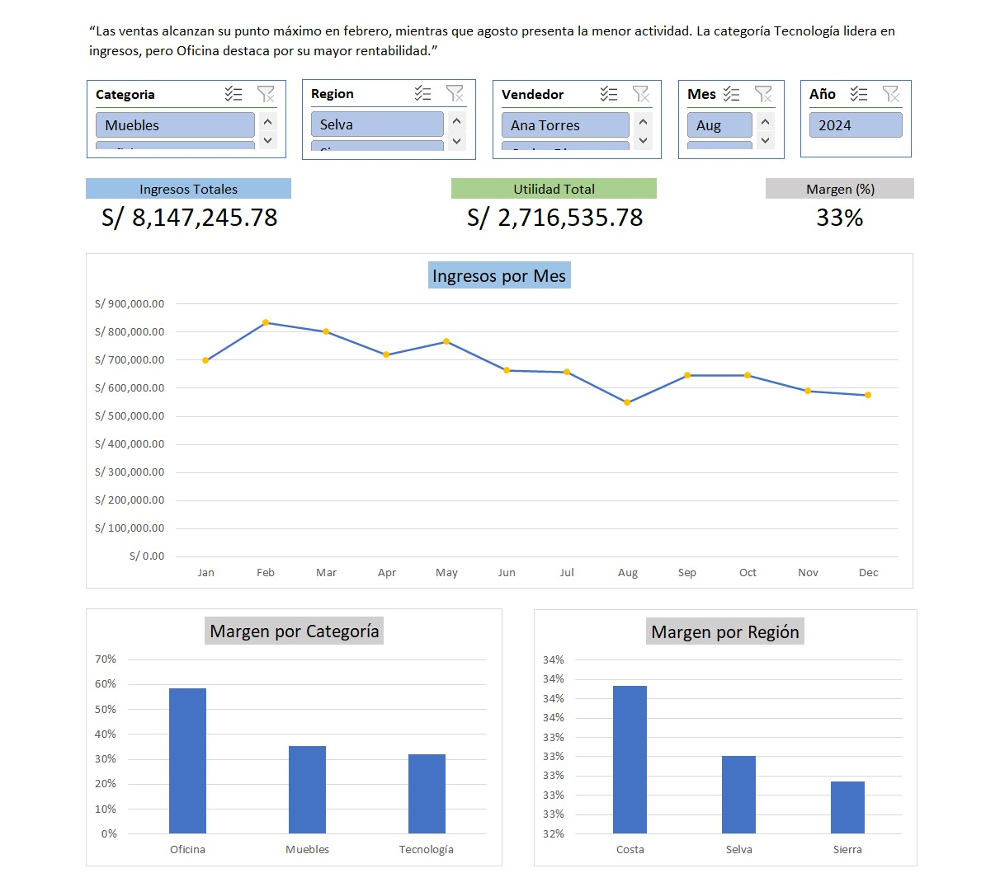

# 📊 Sales Analysis — Excel Dashboard

## 📌 Overview

This project is an **independent sales analysis focused on Excel**, developed as part of a broader end-to-end analytics workflow.

- SQL was used for data cleaning and transformation  
- Power BI was used for advanced visualization  
- **This repository focuses on Excel-based analysis and dashboard development**

The objective is to analyze revenue, profitability, and business performance using dynamic Excel tools.

---

## 🔗 Related Projects

This project is part of a complete analytics workflow:

- SQL Data Analysis (data cleaning & transformation):  
👉 https://github.com/YERHN28/netlive-sql-ventas-analysis  

- Power BI Dashboard (interactive visualization):  
👉 https://github.com/YERHN28/netlive-dashboard-ventas-powerbi  

---

## 🧰 Tools Used

- Microsoft Excel (Pivot Tables, KPIs, Dashboard)  
- SQL (SQLite) — used in previous stage  
- Power BI — used in visualization stage  

---

## 📊 Excel Dashboard

An interactive dashboard was built using:

- Pivot Tables  
- KPI cards  
- Slicers (filters)  
- Line and bar charts  

---

## 📈 Key Metrics

- **Total Revenue:** S/ 8,147,245.78  
- **Total Profit:** S/ 2,716,535.78  
- **Profit Margin:** 33%  

---

## 📊 Visual Analysis

The dashboard includes:

- Revenue trend by month  
- Profit margin by category  
- Profit margin by region  

---

## 🔍 Key Insights

- Technology generates the highest revenue  
- Office category has the highest margin (~59%)  
- Sales show clear seasonality:
  - February → highest sales  
  - August → lowest sales  
- Sierra leads in revenue  
- Costa shows the highest profitability  
- Salespeople have similar margins (~33%) but different sales volumes  

---

## 📷 Dashboard Preview

---

## 🎯 Conclusion

This analysis highlights that higher sales volume does not necessarily imply higher profitability, revealing opportunities to focus on high-margin categories and optimize business strategy.

---
